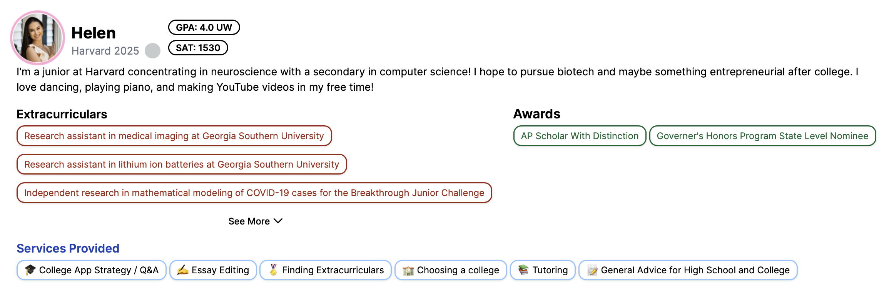

# Code Snippets For React and Java

This repo contains some code snippets. I didn't include the entire codebase so that it would be easier for the reviewer. If you would like to see more code, please let me know!

# React/Next.js Code

## Context

This React/Next.js code is from my project Lacuna Mentors, a platform that connects high school students wtih college mentors for admissions guidance.

This MentorInfo file is a reusable React component that serves as the profile header on mentor pages. The component displays the following information about the mentor:

-   Photo
-   Name
-   Current School
-   Academic Credentials (GPA & Standardized Test Scores)

It also displays a video of the mentor.

## Technologies Used

-   Language: Typescript
-   Framework: Next.js using App Router
-   Styling: Tailwind CSS for styling
-   Video Playback: Mux

# Java Code - Heuristics for AI Chess Playing Agent

## Context

This Java code is from my coursework at Boston University for the class CS 440: Introduction to Artificial Intelligence in Fall 2023.

The assignment was implementing a chess-playing agent.

The Heuristics.java file is part of a larger project. A lot of the code was scaffolded for us and we were responsible for implementing the Heuristics the agent would use to evaluate the chess game state and decide on the best moves.

The class includes both offensive and defensive heuristics and are combined to create a numerical value that represents the state of the game.

## Technologies Used

-   Java
-   Minimax/Alpha-Beeta search algorithms
